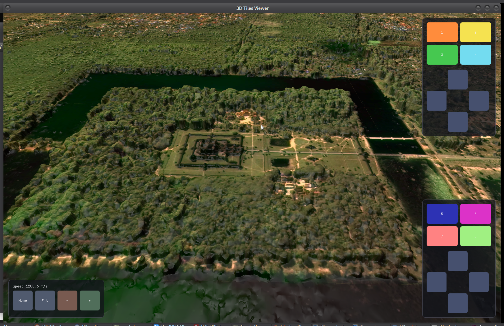

# 3dtiles-viewer

[](https://github.com/n-engine/3dtiles-viewer/actions/workflows/ci.yml)
[](#license)




A lean, native C++ 3D Tiles viewer for Linux (Wayland and X11, via GLFW). Loads a
`tileset.json` (3D Tiles 1.0 with the `3DTILES_content_gltf` extension and 3D
Tiles 1.1 native glTF), walks the tile tree with screen-space-error driven LOD
selection, frustum-culls off-screen nodes, streams `.glb` leaves on demand via a
worker thread pool (closest tiles first), and renders the scene under a free-fly
camera. The GL context is negotiated down a version ladder (desktop core
3.3..4.6, or GL ES 3.0 via `--gles`), so it runs on real GPUs and on software /
virtualized stacks (llvmpipe, virgl) alike.

Designed for:

- Offline desktop preview of photogrammetry tilesets (drone scans, aerial LiDAR,
  Reality Capture / Pix4D outputs).
- Embedded touch surfaces where a thin, no-runtime viewer is preferable to a
  web-engine stack -- there is a built-in touchscreen control overlay (two
  panels + 4-way D-pads + auto-hide after 30 s of idle).
- Cross-compiling to a portable static binary against musl (see
  `scripts/build-static.sh`).

The renderer is intentionally simple: hemisphere ambient + sun NdL + cheap
specular, full sRGB pipeline in the fragment shader, area-weighted face-normal
synthesis when the source mesh ships no per-vertex normals (common in
photogrammetry exports).

## A note on untrusted data

The viewer can load `tileset.json` and `.glb` from arbitrary URLs, so it treats
that content as untrusted: the parsers are hardened to skip a malformed (or
malicious) tile with a logged reason instead of crashing. If you point it at data
you do not control, that is the intended safety net. The how is in the source.

## Build

### Native (recommended for development)

Requirements: `cmake >= 3.16`, `pkg-config`, GCC/Clang with C++17, plus
system packages:

```
glfw3 libepoxy egl wayland-client libcurl   # libcurl optional, see below
```

On Debian/Ubuntu:

```
sudo apt install build-essential cmake pkg-config \
    libglfw3-dev libepoxy-dev libegl-dev libwayland-dev libcurl4-openssl-dev
```

Then:

```
cmake -B build
cmake --build build -j
./build/3dtiles-viewer --mode file --source path/to/tileset.json
```

To stream a public hosted tileset:

```
./build/3dtiles-viewer --mode http \
    --source https://storage.googleapis.com/open-cogs/planet-stac/angkor-wat/3d-geofox.ai/3DTiles/tileset.json
```

(Angkor Wat photogrammetry, ~5k tiles; the window opens immediately and
tiles stream in as you fly around.)

### Build options

| Option              | Default | Effect                                                        |
|---------------------|---------|---------------------------------------------------------------|
| `ENABLE_HTTP_LOADER`| `ON`    | Build the libcurl-backed `--mode http` loader.                |
| `ENABLE_WEBP_TEXTURE`| `ON`   | Decode `EXT_texture_webp` textures via libwebp.               |
| `WAYLAND_ONLY`      | `OFF`   | Hard-fail at startup if GLFW selects anything other than Wayland. |
| `BUILD_STATIC_MUSL` | `OFF`   | Static-link via the musl-cross toolchain (used by `build-static.sh`). |
| `BUILD_TESTS`       | `OFF`   | Build the unit tests; run them with `ctest`.                  |

### Portable static binary

`scripts/build-static.sh` cross-compiles the viewer, GLFW, libepoxy,
wayland-client and friends against a musl-cross toolchain so the result runs
on any modern Linux without per-distro `.so` chasing. See the script header
for the toolchain expectations.

### Tests

The pure-logic units (currently the RFC 3986 URI resolver) have unit tests that
need no GL, network, or filesystem:

```
cmake -B build -DBUILD_TESTS=ON
cmake --build build -j
ctest --test-dir build --output-on-failure
```

CI (`.github/workflows/ci.yml`) builds the GCC and Clang matrix with the HTTP
loader both on and off, runs the tests, and enforces `clang-format`.

## Usage

```
3dtiles-viewer --mode {file|http} --source <tileset.json | URL> [options]
```

| Flag             | Default  | Effect                                                       |
|------------------|----------|--------------------------------------------------------------|
| `--width N`      | `1600`   | Initial window width in pixels. |
| `--height N`     | `1000`   | Initial window height in pixels. |
| `--fullscreen`   | windowed | Open full-screen on the primary monitor. |
| `--sse-pixels N` | `16`     | Refine into children when the projected geometric error exceeds N pixels. Lower values pull in more detail at the cost of more I/O and VRAM. |
| `--max-leaves N` | `256`    | LRU cap on resident GPU tiles. Pass `0` to disable the cap (useful on machines with plenty of VRAM and small tilesets). |
| `--no-cull`      | cull on  | Disable frustum culling and traverse/draw off-screen tiles too (handy for measuring the cull win or debugging traversal). |
| `--gles`         | desktop  | Request a GL ES 3.0 context instead of desktop core (embedded / mobile GPUs). |
| `--no-msaa`      | 4x on    | Disable MSAA. Recommended on software / VM rasterizers (llvmpipe, virgl) where multisampling is costly. |
| `--version`      |          | Print the version and exit. |

Controls (keyboard + mouse):

- WASD / arrow keys: translate
- Mouse drag: orbit
- Mouse wheel: zoom / speed
- `Home`: reset camera
- `F`: fit-to-view

Controls (touch overlay, top-right OBJECT / bottom-right CAMERA):

- Coloured buttons drive object yaw/pitch (top panel) and camera dolly/lift
  (bottom panel).
- 4-way D-pads under each panel drive the corresponding translation/orbit.
- Bottom-left strip: `Home`, `Fit`, camera speed `-` / `+`.

The overlay fades out after 30 s of inactivity and reappears on the next
touch / click. Override the timeout with `VIEWER_UI_HIDE_AFTER=<seconds>`
(`0` disables the auto-hide).

## Project layout

```
src/                  C++ source
data/shaders/         GLSL shaders (copied next to the binary at build time)
third_party/          Vendored header-only deps (glm, stb, cgltf, nlohmann,
                      Dear ImGui)
cmake/                CMake toolchain files
scripts/              build-static.sh (musl cross-build helper)
```

## LOD streaming

The renderer walks the tile tree every frame and computes a screen-space
error for each node:

```
sse_pixels = geometric_error * viewport_height / (2 * distance * tan(fov_y / 2))
```

When `sse_pixels > --sse-pixels`, the node is refined into its children;
otherwise it is drawn and traversal stops. The `refine` field of the spec is
honoured (`REPLACE` skips the parent, `ADD` keeps it).

Before the error test, each node's bounding sphere is checked against the view
frustum (Gribb-Hartmann plane extraction); a node that is fully off-screen is
skipped together with its entire subtree, so off-screen detail is never
traversed or fetched. Pass `--no-cull` to disable this.

Tile fetches go through a 4-thread pool. Worker threads pull bytes via the
selected loader (`file` or `http`); the render thread parses glTF and uploads
GL objects up to 8 tiles per frame. Tiles not yet resident are simply skipped
for that frame -- the camera can fly freely while the world loads in.

Fetches are ordered by camera distance, so the tiles you are looking at arrive
before the ones behind you; a tile still waiting in the queue is re-prioritized
as the camera moves.

The resident set is bounded by an LRU cache (`--max-leaves`). Eviction frees
both CPU and GPU memory; tiles touched in the current frame are never evicted.

## Status

Pre-release (v0.2). LOD streaming, hierarchical frustum culling and
distance-prioritized fetching are in place. The GL context is negotiated at
startup down a version ladder (desktop core 3.3..4.6, or GL ES 3.0 via
`--gles`) and the renderer adapts to what the driver reports -- so it also runs
on software / virtualized stacks (llvmpipe, virgl) instead of hard-requiring a
single GL version. Still on the to-do list:

- Region-type bounding volumes are over-approximated to a generous sphere;
  proper WGS84 -> ECEF math is a follow-up.
- Occlusion culling (frustum + distance + SSE culling only, today).
- Loader priority is a fetch-ordering hint, not a cancel: a tile already handed
  to a worker finishes its fetch even if it scrolls off-screen meanwhile.

The codebase is small enough that the source itself is the canonical
documentation; this README is the entry point, the rest is in the comments.

## Roadmap

See [ROADMAP.md](ROADMAP.md) for what has shipped and what is planned: stability
work, fuzzing, and features -- an online path tracer, live vehicle position
injection, navmesh routing, and scene-object / UI plugins.

## Contributing

Contributions are welcome -- see [CONTRIBUTING.md](CONTRIBUTING.md). In short:
untrusted input is the threat model, portability beats GL features, and
`clang-format` plus the test suite gate CI.

## License

Dual-licensed under [Apache-2.0](LICENSE-APACHE) OR [MIT](LICENSE-MIT) at
your choice.

Vendored third-party libraries keep their own licenses -- see each subtree
under `third_party/`.
